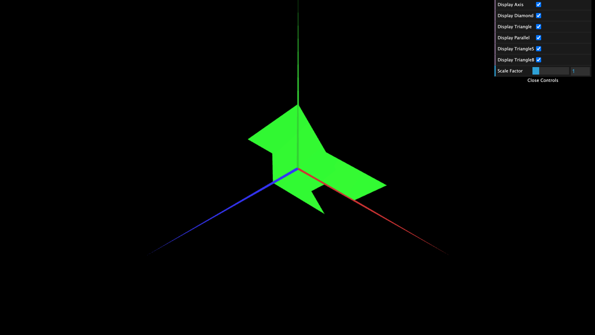

# CG 2024/2025

## Group T07G02

## TP 1 Notes

(add your main observations/remarks about your experiments here, in a bulleted list, and remove this line. Some examples below)

- In exercise 1, we observed the following:
  - A diamond with a diagonal size of 2 units.
  - A right triangle with sides of 2 units.
  - A parallelogram inclined 45 degrees to the right (from the camera's pov) with a length of 2 units and a height of 1 unit.
- The parallelogram is the only figure that has double-sided visibility.
- In exercise 2, the implementation was similar to the previous one, with no significant difficulties.

