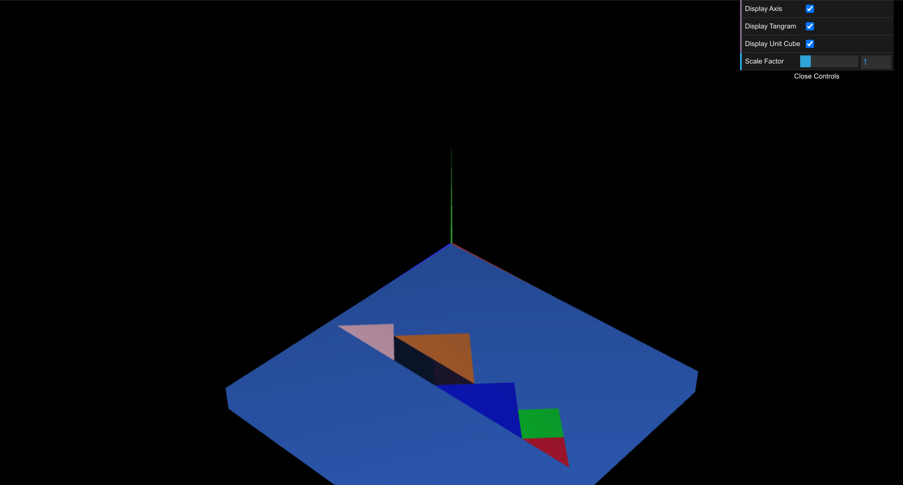
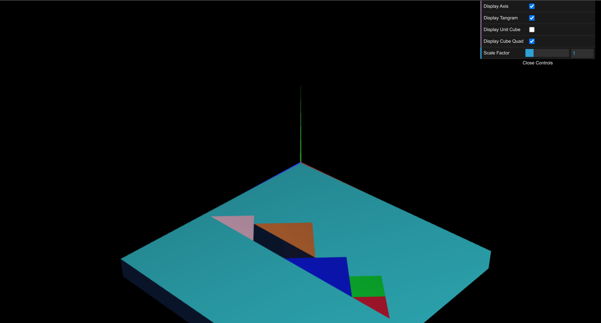

# CG 2024/2025

## Group T07G02

## TP 2 Notes

- In **WebCGF functions for geometric transformations** exercise 3, we utilized the figures created in TP1. By applying geometric transformations, we reproduced the given tangram image and developed a single class, `MyTangram.js`, to represent it as a whole. We did not encounter any difficulties, as our tangram was relatively simple.

- In **Three-dimensional geometry - Unit Cube** exercises, we started by defining the 8 vertices of the cube, and then created the 6 faces, each composed of 2 triangles, resulting in a total of 12 triangles. We paid special attention to ensure that all faces were visible from each specific point of view. Then we rotated both the tangram and the cube around the X axis and translated the cube so that its top left corner was at (0, 0, 0). To ensure the entire tangram was visible, we moved it 0.1 units upward.

- In **Composite Geometry - Cube composed of Planes** exercises, e first defined `MyQuad` as a unit square centered at the origin. Then, within `MyUnitCubeQuadClass`, we used rotations and translations to display the same initial cube as in the previous exercise. Finally, to reproduce the last version of the unit cube from the previous exercise, we applied the same geometric transformations and changed the color to differentiate it.

