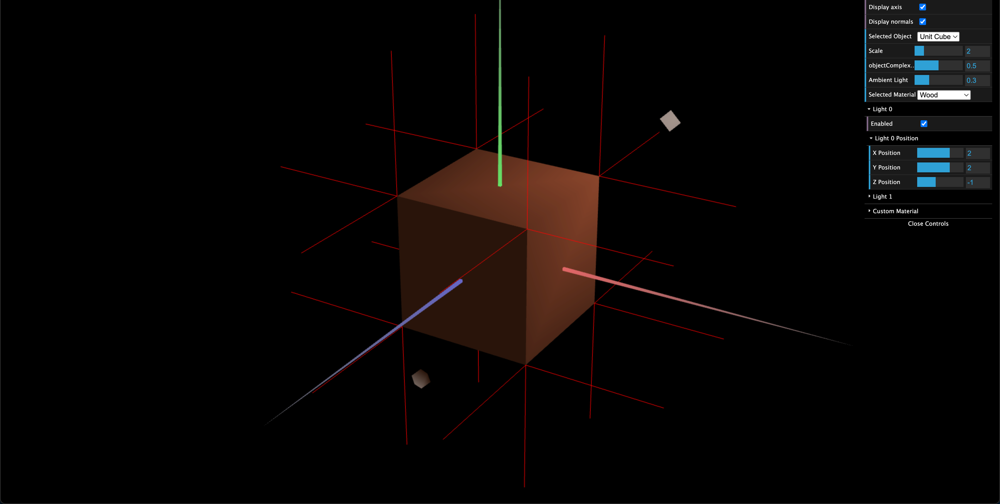
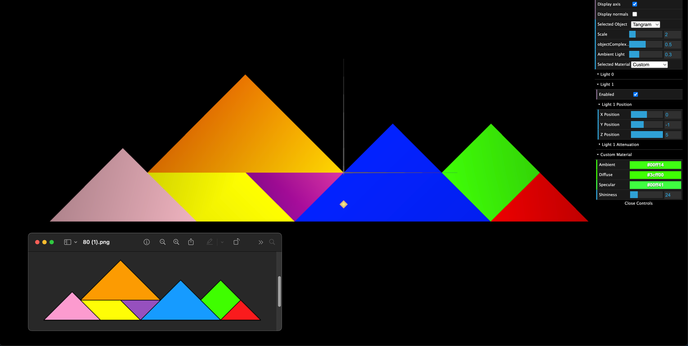

# CG 2024/2025

## Group T07G02

## TP 3 Notes
- In the first exercise, the correct normals were set for the cube and tangram to reflect light accurately and naturally. 
- A wood material was also created, as shown in the figure 1.

Figure 1 - Wood cube  

- Each tangram piece was assigned a material with the correct color and high specular, as shown in Figure 2. The MyDiamond piece (green) uses a custom material adjustable via the interface.

Figure 2 - MyTangram colored  
