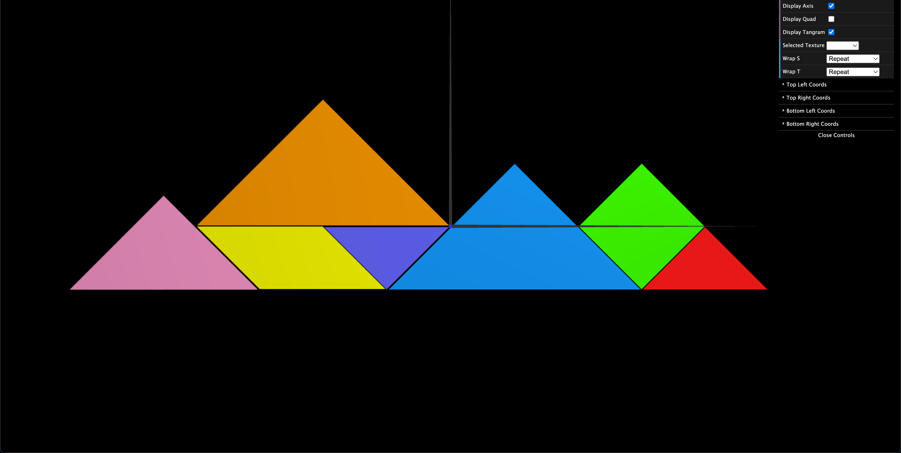
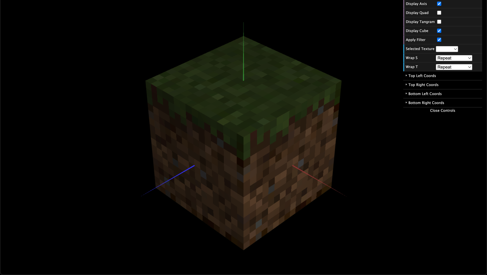

# CG 2024/2025

## Group T07G02

## TP 4 Notes
- The tangram's objects were textured using `tangram.png`, with each piece correctly mapped to its respective color.
- For the triangles, a new argument was added to the `MyTriangleBig` and `MyTriangleSmall` constructors to define their texture coordinates.

Figure 1 - Tangram with textures  

- The top and bottom faces were textured using `mineTop.png` and `mineBottom.png`, respectively, while the sides were textured with `mineSide.png`. Initially, we noticed that the faces appeared darker than expected. The issue was related to the material applied to each quad. To resolve this, we added a `cubeMaterial` in the "Applied Material" section of `MyScene.js`, ensuring the material was correctly identified and properly illuminated. 

- After fixing the material issue, we observed that the texture appeared blurry because the texture image was much smaller than the area it needed to cover. To address this, we changed the texture filtering method from the default `LINEAR` to `NEAREST`, which provided a sharper appearance.

Figure 2 - Cube with Linear Texture Filtering  

Figure 2b - Cube with Nearest Texture Filtering  