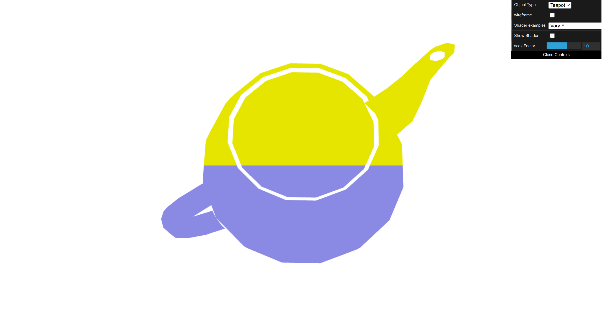
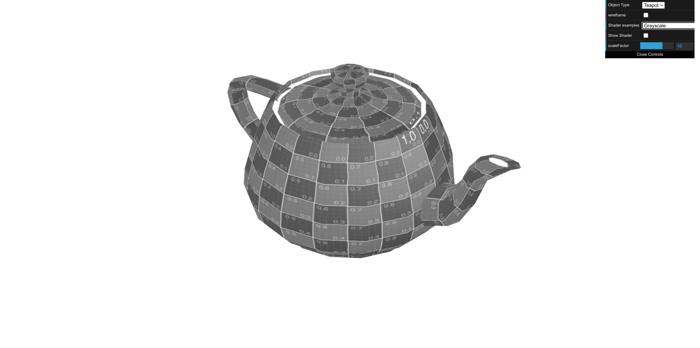
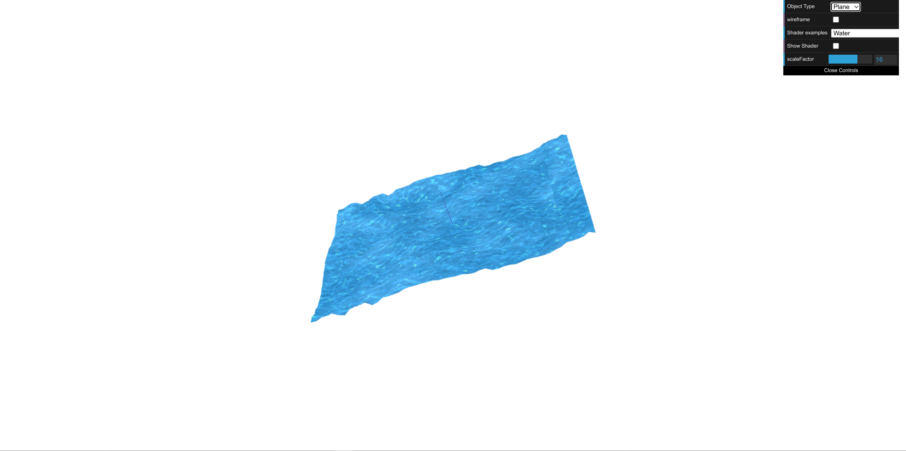

# CG 2024/2025

## Group T07G02

## TP 5 Notes
- We created the files `varying_y.vert` and `varying_y.frag` to show yellow in the upper half and blue in the lower half.

Figure 1 - Teapot colored  

- In the second part of the exercise, we created the files `xx_anim.vert` and `xx_anim.frag` to implement an animation shader. This shader produces a back-and-forth translation effect along the X-axis, following a sinusoidal wave. The amplitude of the motion is controlled by the scaleFactor parameter from the interface, allowing dynamic adjustments.

- After that, we developed the `grayscale.frag` shader, which applies a grayscale effect to the object. The implementation is similar to the `sepia.frag` shader, but it modifies the RGB components to achieve a grayscale appearance instead of a sepia tone.

Figure 2 - Teapot grayscale  

- We created `water.vert` and `water.frag` shaders based on `texture2`. The vertex shader uses `waterMap.jpg` as a heightmap to displace vertices along the Z-axis based on the blue channel, creating waves controlled by the `heightScale` uniform. The fragment shader applies `waterTex.jpg`, animating its coordinates with timeFactor to simulate flowing water. Using `fract()`, texture coordinates wrap seamlessly for continuous movement.

Figure 3 - Water Effect  